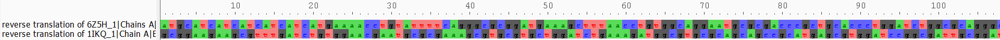
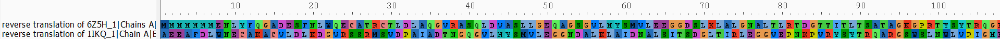
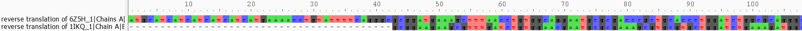

# AliView: Visualizing and aligning protein sequences

## Introduction
Visualizing multiple protein sequences at once and then aligning them are  an important steps in understanding how proteins are similar and different from each other. AliView is a good tool to visualize and align due to its color-coding, ability to show both nucleotide and translated amino acid sequences, and integration of outside sequence alignment tools. In this page, I will explain how to start using AliView and utilize two valuable functions within this tool. 

## I. Installing AliView
AliView can be installed from the [AliView website](https://ormbunkar.se/aliview/). After navigating to the website, click "Download the latest stable version" and follow all instructions to complete the download of this tool.

As an example, I will use the *Pseudomonas aeriginosa* (PDB ID: 1IKQ) and *Aeronomas* (PDB ID: 6Z5H) exotoxin A (ExoA) sequences, since 1IKQ was the structure of interest in Washington iGEM's 2025 project. Since the PDB only contains protein sequences, I reverse translated their sequences on [bioinformatics.org](https://www.bioinformatics.org/sms2/rev_trans.html) to obtain nucleotide sequences for demonstration purposes.

## II. Opening sequence alignments
Once AliView is installed and opened, protein or nucleic acid sequences in FASTA format can be opened. To open an existing FASTA file, go to "File" > "Open File" > [path to file] > "Open." FASTA-formatted pieces of text can also be directly pasted into an AliView window with `Ctrl+V` or right click+"Paste." This should produce an image similar to the one below with color-coded nucleotides. 

## III. Showing nucleotide sequence alignments as translated amino acids
In this instance, we started with a protein sequence, but in other cases, only a nucleotide sequence coding for a protein is provided. Luckily, AliView offers an option to show sequences as its translated amino acids. This can be accessed with `Ctrl+Shift+T` or "View" > "Show as translation (1 pos per AminoAcid)" (the other options show weird visualizations). This should produce color-coded amino acid sequences as shown below.

## IV. Aligning sequences to each other
Arguably the most useful tool in Aliview is the ability to quickly and easily align sequences. Aliview offers multiple methods to align sequences, but based on BIOL 426, Muscle is best.

To select an alignment method, go to "Align" > "Change default Aligner program" > "for realigning all (or selected blocks)," click on the circle next to "Muscle" (it should already be selected by default), and click "OK." Next, complete the actual alignment with "Align" > "Realign everything as Translated Amino Acids." Since we are working with protein-coding nucleotide sequences, it is most logical to align based on codon.

The result should be like below, with indels marked with dashes. The visualization can also be shown as translated amino acids as demonstrated in (III) since we aligned everything as translated amino acids. 

These alignments can also be saved at "File" > "Saved as Fasta" > [path to output file] > "Save."

## Conclusion
When comparing nucleotide or amino acid sequences, visualizations can be helpful, and AliView is a fast and simple tool which not only visualizes sequences, but can also align them. In this example, I have only used two sequences, but AliView is effective and arguably more useful when working with larger sets of sequences. 
