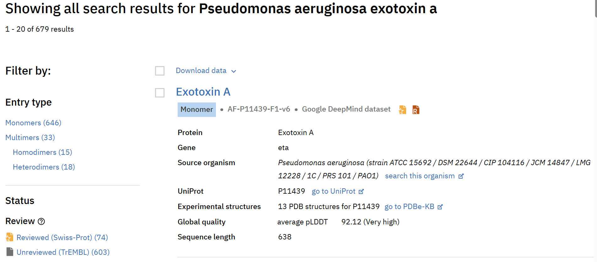
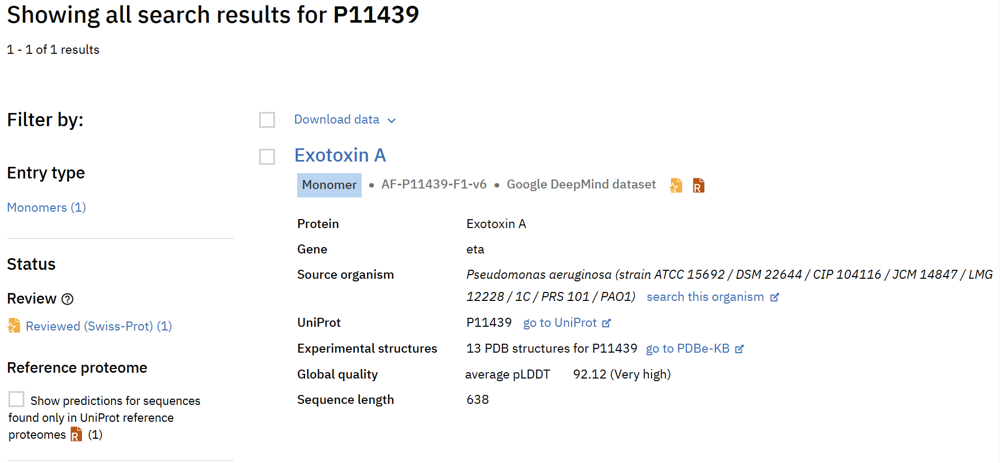
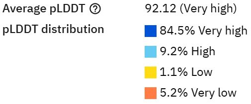
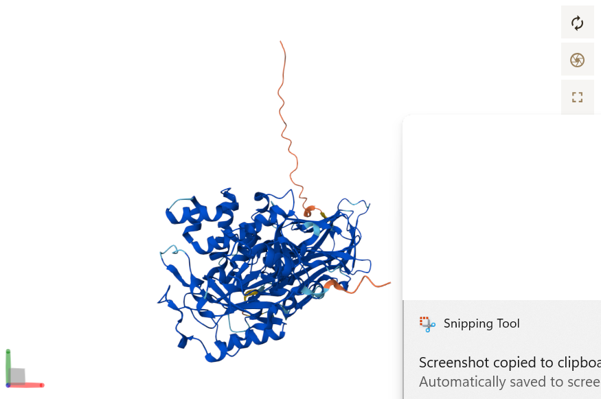
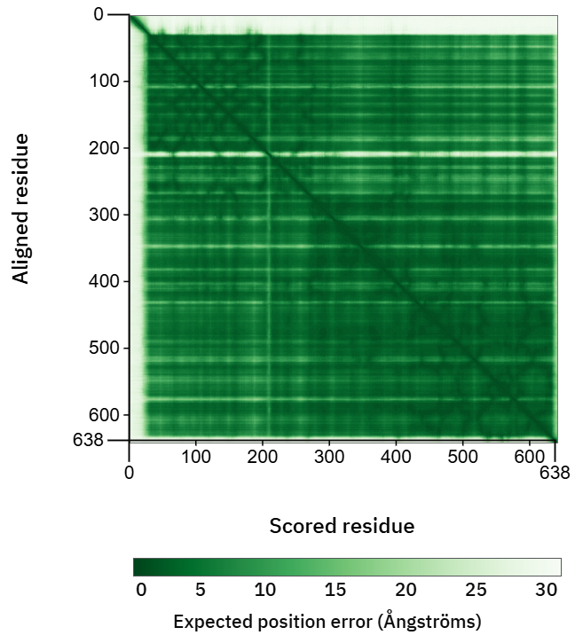

# AlphaFold Protein Structure Database: Models of proteins with no determined structure

## Introduction
The AlphaFold Protein Structure Database (AFDB), as the name suggests, is a database of protein structures. But unlike other databases like the PDB which contain *in vitro* structure predictions from X-ray crystollography or cryo-EM, this database contains computational structure predictions produced by Google DeepMind's AI-based model AlphaFold. AlphaFold is not perfect, but is still much more accurate than previous models.

In this page, I will provide an overview of how to use the AFDB, and as an example, I will search for *Pseudomonas aeriginosa* Exotoxin A, which was the primary protein of interest in Washington iGEM's 2025 project!

This tool is different from [AlphaFold Server](https://alphafoldserver.com/), though that is also a very cool piece of software to explore!

## I. Accessing the AlphaFold Protein Structure Database
Unlike some other tools explored in this repository, the AFDB is purely web-based, so accessing it is as simple as going to its website (https://alphafold.ebi.ac.uk/).

## II. Searching for your protein of interest
Within the AFDB, you can search for proteins in multiple different ways. Here, I will highlight two methods to find your protein of interest. 

The first and arguably most straightforward way to find proteins is searching by the protein name. Since many proteins will have the same name in multiple species, it is important to include both the species name and the protein name in your search. In my example, I searched for "Pseudomonas aeriginosa exotoxin a," and my protein of interest was the first result. 

As shown below, the result provides information about the protein, gene, and source organism name, which is useful to confirm accuracy.

For more certainty that you are selecting your intended protein, it can be helpful to first find the protein in [UniProt](https://www.uniprot.org/) and obtain its UniProt entry number. From this website, we see that [*Pseudomonas aeriginosa* exotoxin A](https://www.uniprot.org/uniprotkb/P11439/entry)'s UniProt entry number is P11439. When we use this as our AFDB search term, we get the same first result as before, and this time, it is the only result to appear. 

## III. Accessing the AlphaFold model and validating its accuracy
Clicking on the protein name displayed after searching in AFDB opens the AlphaFold-predicting model, and after doing so, one important factor to consider is the predicted accuracy of this structure. As a computational model, AlphaFold is not alway accurate, but to help assess accuracy, the AFDB provides two useful metrics: pLDDT and pAE.

[pLDDT](https://www.ebi.ac.uk/training/online/courses/alphafold/inputs-and-outputs/evaluating-alphafolds-predicted-structures-using-confidence-scores/plddt-understanding-local-confidence/), or predicted local distance difference test, is a metric measuring AlphaFold's confidence that the prediction is accurate. This metric provides a single value for each residue on a scale of 0 to 100, with 100 being the most confident and >90 considered a "very high" score. 

This value is listed on the right side of the summary displayed on the AFDB page, and as we can see on this image, the ExoA AlphaFold output has a very high average pLDDT, suggesting that it is a high-confidence prediction. The AFDB also colors the output protein structure based on pLDDT, providing context to which regions of the protein are predicted with high or low confidence. 

[pAE](https://www.ebi.ac.uk/training/online/courses/alphafold/inputs-and-outputs/evaluating-alphafolds-predicted-structures-using-confidence-scores/pae-a-measure-of-global-confidence-in-alphafold-predictions/), or predicted aligned error, is another metric in the AFDB, and it provides a value in Angstroms of how far away the predicted structure is from the actual structure when comparing two residues in the protein. Unlike pLDDT, we want to minimize this value since we want the difference between the predicted and actual structure to be minimized. 

In the AFDB, pAE values are visualized in a green plot comparing each residue against each other, where darker green areas indicate positions with a low pAE (high accuracy) and lighter green or white areas signifying a high pAE (low accuracy). For ExoA, we see nearly all dark green with some whiter areas, suggesting that most, but not all, of the predicted protein structure is expected to be accurate.

In conjunction with actual structure generation methods, the two computational accuracy metrics pLDDT and pAE are useful values to assess the usefulness of accuracy predictions in the AFDB.

## IV. Downloading the AlphaFold model
For further analysis, it can be useful to download the AlphaFold-generated structure and view it with structure visualization softwares such as PyMOL or [ChimeraX](https://github.com/akiram3/bioinformatic-tools-biol426/blob/main/chimerax.md). To do so, click on the blue button labeled "Download files" in the top right of the AFDB page, and click either "mmCIF file" or "PDB file" (PDB is recommended, but both should work the same).

## Conclusion
The AlphaFold Protein Structure Database is an exciting tool to understand the structure of proteins, particularly those whose structures have not been determined through *in vitro* methods. Though it is not perfect, the AFDB is the most accurate and accessible service currently available, and the metrics it calculates also provides strong information about how strongly to consider its output. Here, I provide step-by-step instructions about how to find a protein structure in the AFDB, assess its accuracy, and download it for further analysis in other tools.
