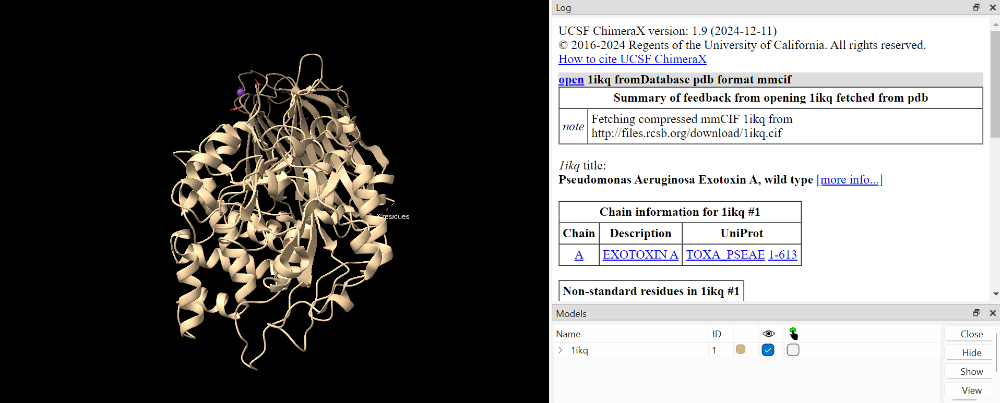
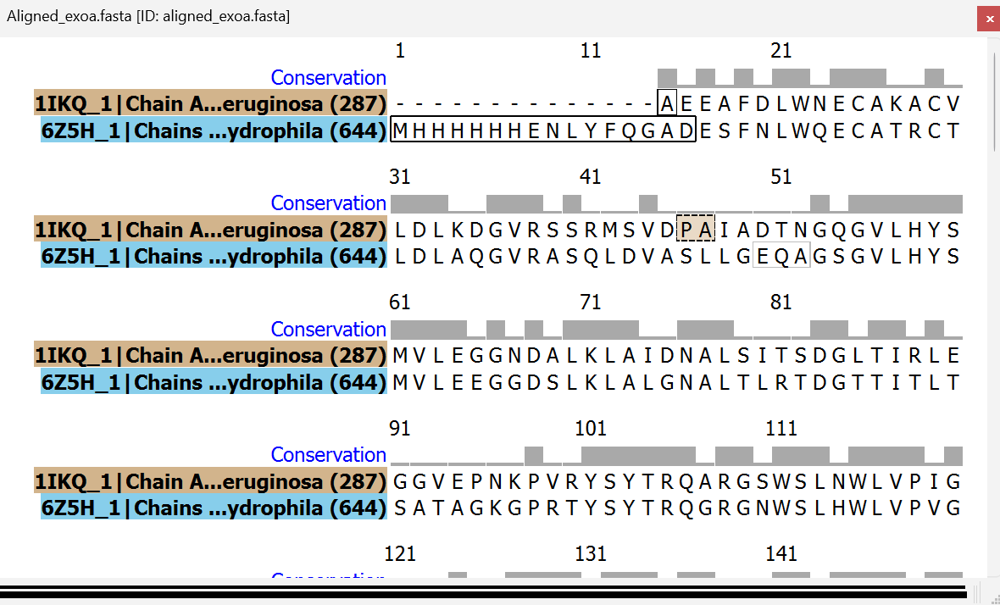
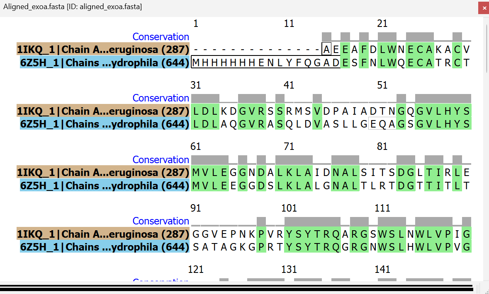

# ChimeraX: Visualizing protein structure and alignments

## Introduction
One useful way to study structure-function relationships of proteins is to visualize its three-dimensional structure. Here, I explain how to visualize a PDB structure, compare locations of polymorphisms between different structures, and color specific residues or domains using the software tool ChimeraX. When possible, I have tried my best to include both graphical and command-line methods to complete each task. 

These methods can generally also be used for Chimera with small edits. 

As an example, I will use the wild-type structure of *Psuedomonas aeriginosa* Exotoxin A (PDB ID: 1IKQ), which was used for Washington iGEM's 2025 project.

## I. Installing ChimeraX
To download ChimeraX, go to the [UCSF ChimeraX website](https://www.rbvi.ucsf.edu/chimerax/download.html). Click on the most recent .exe file (should be at the top), accept agreements and terms, and follow the remaining instructions to set up this software. 

## II. Loading a protein structure
Protein structures in .pdb or .mmCIF format can be loaded into ChimeraX for visualization in multiple different ways. 

First, if a protein has been deposited into the Protein Data Bank (PDB), its structure can be accessed directly using PDB ID.
- Command line: `open 1ikq`
- Graphically: "File" > "Fetch By ID..." > "PDB" > "1ikq" > "Fetch"

In addition, you can also load a downloaded .pdb/.mmCIF file into ChimeraX. 
- Command line: `open /path/to/structure.pdb`
- Graphically: "File" > "Open" > [path to structure] > "Open"

Both methods should result in a protein structure appearing on your screen similar to the image below.

## III. Compare conserved residues and polymorphisms between multiple protein sequences
One strength of ChimeraX is its utility for analyzing protein sequence alignments. Here, I am aligning the sequence of 1ikq and *Aeronomas* Exotoxin A (PDB ID: 6Z5H), which I found from a UniProt BLAST search of the 1IKQ sequence.

After obtaining protein structures and sequences, first load the structures as described in part II. Then, load the aligned sequences in FASTA format into ChimeraX as well (I took the FASTA for each structure from the PDB website and aligned them with AliView).
- Command line: `open /path/to/alignment.fasta`
- Graphically: "File" > "Open" > [path to alignment] > "Open"

After loading in sequences, they should automatically be assigned to the correct structure and the alignment should open in the right sidebar. For ease of viewing, the alignments can be visualized in a new window by clicking the gray bar at the top of the alignment and dragging it away. 

After generating these alignments, you can select conserved residues between the two sequences. It is most straightforward to do this command graphically.
- Graphically: Right click on the sequence viewer > "Structure" > "Select by Column Identity" > "100%"

## IV. Color specific residues and domains
When visualizing protein structures, it can be helpful to adjust the color of the whole protein or specific parts. In this example, I will be changing the color of conserved residues between 1IKQ and 6Z5H from the default tan color to to red as selected in the previous section. 
- Command line: `color sel red`
- Graphically: "Actions" (in top bar) > "Color" > "Red"

Graphically, you can also click on specific residues in the sequence and color them- each secondary structure within the protein should be highlighted in the sequence viewer!

## Conclusion
ChimeraX is a very useful tool for visualizing protein structures to help understand structure-function relationships. In addition, one benefit of ChimeraX compared to other structure visualization tools is its ease of use for aligning multiple structures and visualizing conserved or polymorphic residues. In this page, I have explained three functions of ChimeraX, but there are many other useful functions contained within this tool as well.  
