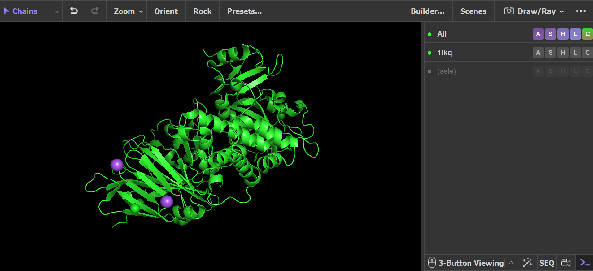
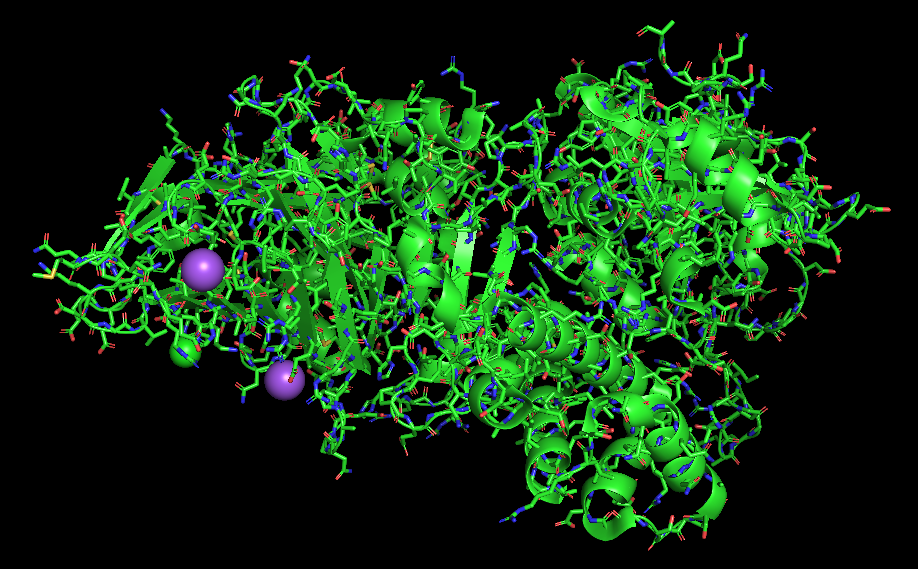
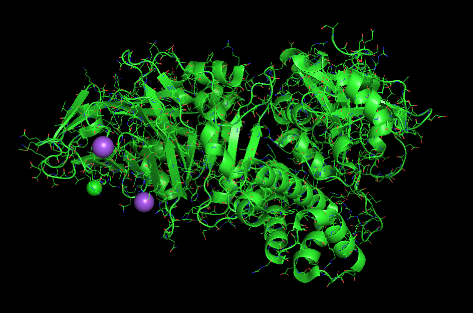
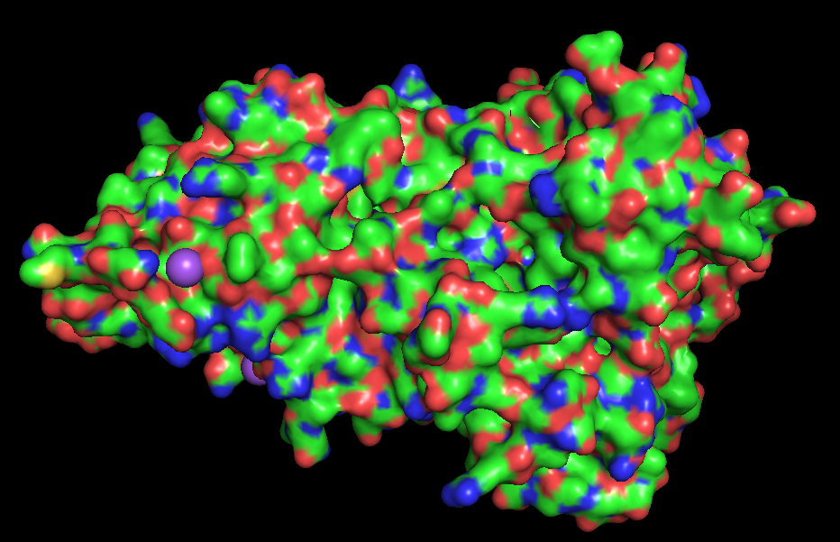

# PyMOL: Visualizing protein structure

## Introduction
Visualizing and manipulating three-dimensional protein structures is a useful strategy to understand a protein's function. PyMOL is one widely used structure visualization tool with a variety of functions to clearly visualize many aspects of a protein. When possible, I have included both graphical and command-line methods to complete each task.

As an example, I will use the wild-type structure of Psuedomonas aeriginosa Exotoxin A (PDB ID: 1IKQ), which was used for Washington iGEM's 2025 project.

## I. Installing PyMOL
PyMOL can be downloaded from the [PyMOL website](https://www.pymol.org/). After navigating to the website, click "Download now" and then the option corresponding to your operating system (for Windows, the EXE Installer generally works best). Once the download begins, follow all listed instructions. 

PyMOL requires a license for permanent use, but high school and college students can register for a [Education license](https://pymol.org/edu/) to use PyMOL for coursework, homework, and figure generation.

## II. Loading a protein structure
Protein structures in .pdb or .mmCIF format can be loaded into PyMOL for visualization in multiple different ways.

First, if a protein has been deposited into the Protein Data Bank (PDB), its structure can be accessed directly using its PDB ID.
- Command line: `fetch 1ikq`
- Graphically: "File" > "Get PDB..." > "PDB ID: [1ikq]" > "Download"

In addition, you can also load a downloaded .pdb/.mmCIF file into ChimeraX. 
- Command line: `load /path/to/structure.pdb`
- Graphically: "File" > "Open" > [path to structure] > "Open"

Both methods should result in a protein structure appearing on your screen similar to the image below.

## III. Visualizing interaction within/between proteins
One useful aspect of PyMOL its the ability to easily show a protein's structure in ways other than its larger secondary structures. This can be useful to understand a protein's structure in detail and understand likely binding sites or interactions. There are many ways to visualize proteins in PyMOL, but in this page, I will highlight three that are potentially especially useful. 

The default PyMOL protein visualization only shows the secondary structures in the protein, but showing individual atoms within each side chain can be helpful in situations such as understanding inter- or intra-protein interactions. The most straighforward way to do this is to show the side chains as sticks. Graphically, click on the "S" button on the right sidebar corresponding to the protein you want to work with (you can also choose all loaded structures).
- Command line: `show sticks`
- Graphically: "S" > "sticks"

In some instances (such as the image above), sticks can be too large to effectively understand side chain function. To address this, another way to visualize side chain atoms in a slightly thinner view is showing wires.
- Command line: `show wires`
- Graphically: "S" > "lines"

Beyond side chains, another useful visualization method to understand protein function is showing its outer surface area. This can highlight regions with shapes which are likely to be binding or interaction sites.
- Command line: `show surface`
- Graphically: "S" > "surface"

To hide any of these visualizations, use `hide` instead of `show` in the command line or click the "H" instead of the "S" graphically. 

## IV. Saving images of structures
In addition to the variety of visualization methods it offers, another utility that PyMOL offers is the ability to save those visualizations effectively in multiple formats. PyMOL allows you to save an image, structure, movie of a structure, and a session containing the structures you currently have open, but in this page, I will show how to save images. 
- Command line: `png /path/to/image.png`
- Graphically: "File" > "Export Image As" > "PNG..." > "Save PNG image as..." > "Save"

## Conclusion
PyMOL is a versatile software tool for studying and saving protein structures in multiple ways. Though there are multiple strategies, including the ability to edit the pymolrc, that I have not discussed in this page, I hope that this provides a broad overview of how to use PyMOL for protein structure visualization.
